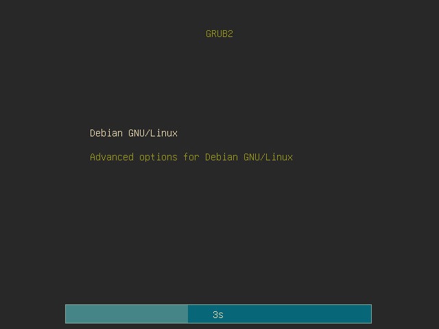

# GruvGRUB

## about
A minimal gruvbox GRUB2 theme
## dependencies
- [GRUB2](https://www.gnu.org/software/grub/)
- [Iosevka Nerd Font](https://www.nerdfonts.com/)
## installation
1. `git clone https://github.com/aldavs/GruvGRUB.git && cd GruvGRUB/`
2. `chmod 755 install.sh && ./install.sh`
